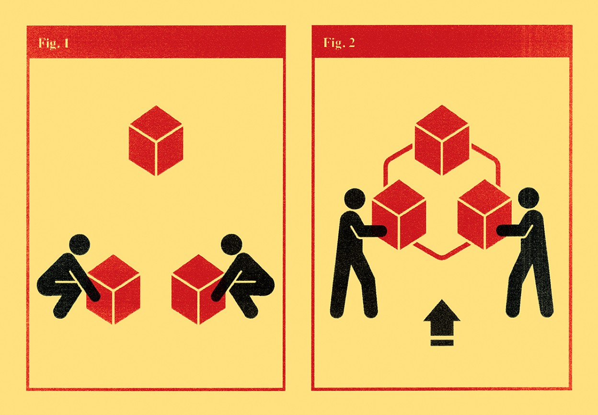
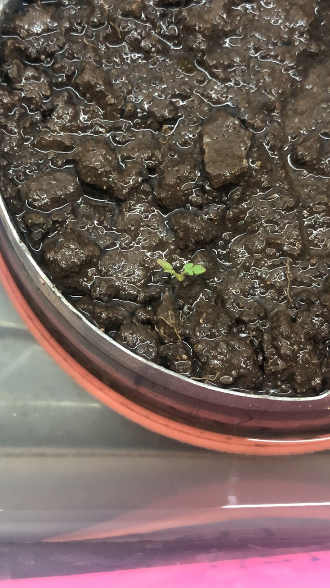
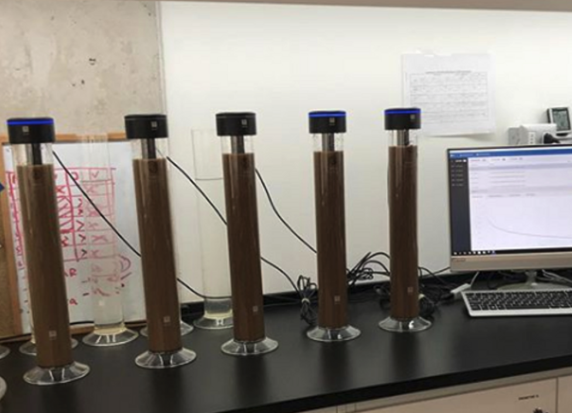
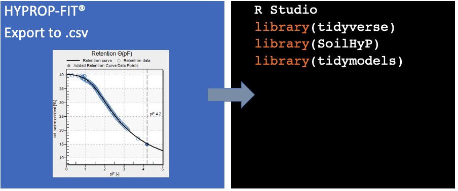
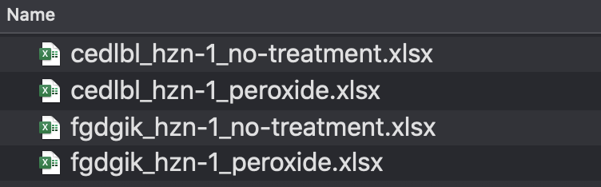

name: about-me
class: about-me-slide, inverse, middle, center

# About me


*Sara Acevedo*

*Dr. (c) Ciencias de la Ingeniería, PUC*
*Msc. Soil and Biogeochemistry, UCDavis*

.fade[Pontificia Universidad Católica de Chile<br>Santiago, Chile]

[`r icons::fontawesome("link")` saryace.github.io](https://saryace.github.io)
[`r icons::fontawesome("twitter")` @saryace](https://twitter.com/saryace)
[`r icons::icon_style(icons::fontawesome("github"), scale = 1)` @Saryace](https://github.com/Saryace)
---
name: about-me
class: about-me-slide, inverse, middle, center

# About Soil Biophysics Lab


*Laboratorio de Biofísica de Suelos*

*PI: Dr. Carlos Bonilla*

.fade[Pontificia Universidad Católica de Chile<br>Santiago, Chile]

[`r icons::fontawesome("link")` biofisica.ing.puc.cl](https://biofisica.ing.puc.cl)
[`r icons::fontawesome("twitter")` @soilbiophysics1](https://twitter.com/soilbiophysics1)
[`r icons::icon_style(icons::fontawesome("instagram"), scale = 1)` @soilbiophysicslab](https://www.instagram.com/soilbiophysicslab)
---

class: inverse

## Soil Biophysics Laboratory

```{r,out.width='100%', fig.height=5,echo=FALSE,warning=FALSE,message=FALSE}
library(leaflet)
library(dplyr)
leaflet() %>%
  addTiles() %>%
  addPopups(lng = -70.6149164,
             lat =  -33.4995699,
             popup = "Soil Biophysics Lab",
             options = popupOptions(closeButton = FALSE)) %>% 
  setView(lng = -70.6149164,
          lat =  -33.4995699,
          zoom = 17)
```
---


##Acknowledgments
.pull-left[

This research was supported by funding from the National Commission for Scientific and Technological Research FONDECYT/Regular 1191166

]

.pull-right[


]
---
background-image: url('img/program3.png')
background-size: cover
class: middle, center, inverse

# **Introduction**

---

class: middle

## Laboratory-scale data management
###from spreadsheets to large datafiles

.footnote[Source: [Nowogrodzki 2020](https://www.nature.com/articles/d41586-020-00062-z)]
---

##Rationale

.pull-left[

*  Automated data collection overwhelms the ability of scientists to effectively manage and and analyze data (Michener et al., 1997)

* Soil physics has been no exception, transforming over into a data-intensive field. 

* Datasets are only getting bigger — and more challenging to work with (Nowogrodzki 2020)

]

.pull-right[

]

---

.pull-left[
## Some challenges of generating soil datasets

* Human error
* Data unshareable or cryptic
* Inconsistencies in data analysis 
]

.pull-right[
<br>
<br>
<br>
 **Typing files names be like:**
.typed[]
]

---
.pull-left[
## Proper laboratory-scale data management can: 

* Decrease human source of errors
* Increase accessibility of data through time 
* Make research reproducible and collaborative
]

.pull-right[

]

---

###This presentation will cover:

#### * Good practices for laboratory-derived soil datasets
#### * A demo example of how these practices improve reproducibility 

---

background-image: url('img/lab1.jpeg')
background-size: cover
class: inverse, middle, center

# **Material and methods**

---

## Soil water retention curves
.pull-left[
* Simplified evaporation method + dewpoint potentiometer
* High resolution soil water retention curves
* Twelve undisturbed soil cores from the top horizon
]

.pull-right[
<iframe width="380" height="260" align="right" src="https://www.youtube.com/embed/MdnSEf07Vz8?t=110" frameborder="0" allow="accelerometer; autoplay; encrypted-media; gyroscope; picture-in-picture" allowfullscreen></iframe>
]

---
## Soil particle size distribution
.pull-left[
* Sedimentation method
* Semi-continuous particle size distribution curve
* Twelve soil sieved samples, pre-treated with H<sub>2</sub>O<sub>2</sub>
* Twelve soil sieved samples, no pre-treated 
]

.pull-right[

]

---

## Data recording and analysis
.pull-left[
* Windows-based software from the manufacturer
* Export formats: .xlsx and/or .csv
* Data stored in a cloud service
* Data analysis: R
]

.pull-right[

]
---

## Good practices:

---

## Good practices:

----

.left-col[.center[
`r icons::icon_style(icons::fontawesome("universal-access"), scale = 1.5)`
### keep data human-and-machine readable
]]

--

.center-col[
.center[
`r icons::icon_style(icons::fontawesome("chart-bar"), scale = 1.5)`
### use scripts and not touch raw data
]]

--

.right-col[.center[
`r icons::icon_style(icons::fontawesome("r-project"), scale = 1.5)`
### use data validation to avoid errors
]]

---

background-image: url('img/san_joaquin.jpeg')
background-size: cover
class: inverse, middle, center

# **Results and demo**

---
## Data collected
```{r}
curves_psd <- read.csv("data/curves_pario_sssa.csv")
curves_swrc <- read.csv("data/curves_swrc_sssa.csv")
```
## Amount of data particle size distribution (n = 12)
```{r, echo=FALSE, message=FALSE}
curves_psd %>%
  group_by(soil_id, treatment) %>% 
  summarise(n = n()) %>% 
  rmarkdown::paged_table(.,options = list(rows.print = 5))
```
---
## Amount of data soil water retention curve (n = 12)
```{r, echo=FALSE, message=FALSE}
curves_swrc %>%
  group_by(soil_id,device) %>% 
  summarise(n = n()) %>% 
  rmarkdown::paged_table(.,options = list(rows.print = 5))
```
---
## Data collected
.pull-left[
### Soil<br>water retention curves
* Full curves with 78 - 100 points
* Number of data from dewpoint method depends on operator
]

.pull-right[
### Soil<br>particle size distribution
* Standard curves with 500 points
]
---
### keep data human-and-machine readable: files and variables names
#### * Files should be named consistently
#### * File names should be short but descriptive (<25 characters)
#### * Avoid special characters or spaces in a file name
#### * Use capitals and underscores instead of periods or spaces or slashes

More info in Jenny Brian's presentation: [naming things](http://www2.stat.duke.edu/~rcs46/lectures_2015/01-markdown-git/slides/naming-slides/naming-slides.pdf)
---
### keep data human-and-machine readable: columns names
```{r}
curves_psd %>%
  rmarkdown::paged_table(.,options = list(rows.print = 5))
```
---
### keep data human-and-machine readable: file names

.pull-left[
```{r, eval = FALSE}
files_list <- list.files(pattern = "*.xlsx",
                         full.names = TRUE)
df_psd_list<-
  setNames(lapply(files_list,
                  function(x)
    read_excel(x,
               sheet = 4,
               range = "B8:F508")),
    files_list)
```
]

.pull-right[

]
---
### use scripts and not touch raw data
#### Check data of hyprop within accuracy	of 1.5 hPa (0 hPa to 820 hPa)
```{r}
curves_swrc %>%
  group_by(soil_id) %>% 
  filter(device == "sem" & suction <= 820) %>% 
  rmarkdown::paged_table(.,options = list(rows.print = 5))
```
---
### use data validation to avoid errors
#### Soil water content exceeding its physical plausibility range (over porosity or below 0) 
```{r}
curves_swrc %>%
  group_by(soil_id) %>% 
  filter(water_content < 0.8 & suction > 0) %>% 
  rmarkdown::paged_table(.,options = list(rows.print = 5)) #example value
```
---
### Conclusions

#### *Data management is crucial for reproducibility in soil science 
#### *Naming files and variables properly can save time and information in the laboratory work
#### *Using scripts and data validation can improve data quality and reproducibility

---
class: goodbye-slide, inverse, middle, right

.pull-right[
# Thanks for watching this presentation!

### Questions? Comments? 

.left[
[saryace.github.io `r icons::fontawesome("link")`](https://saryace.github.io)<br/>
[@saryace `r icons::fontawesome("twitter")`](https://twitter.com/saryace)<br/>
[@Saryace `r icons::fontawesome("github")`](https://github.com/Saryace)<br/>
]]
