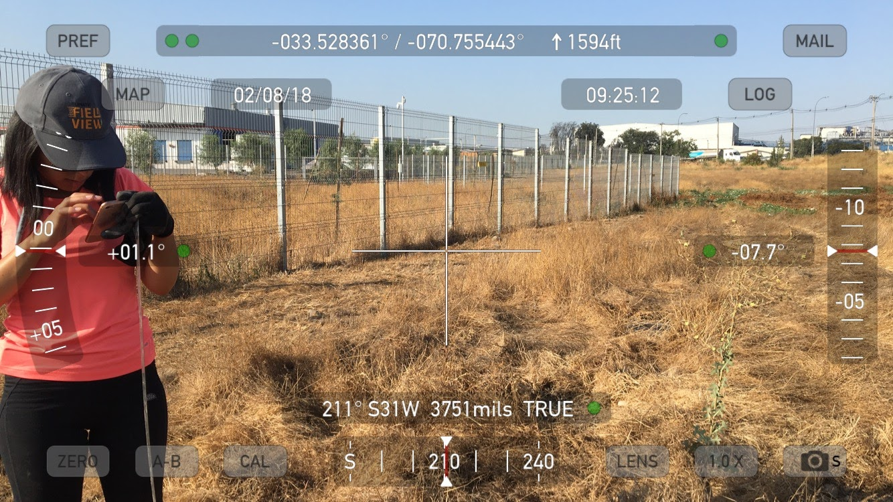
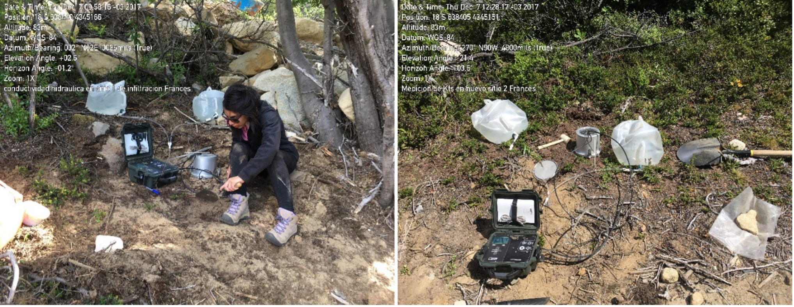
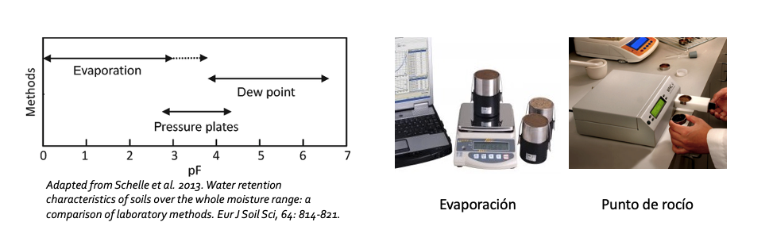
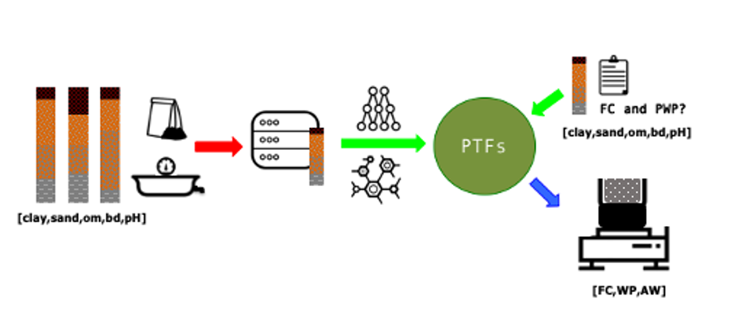
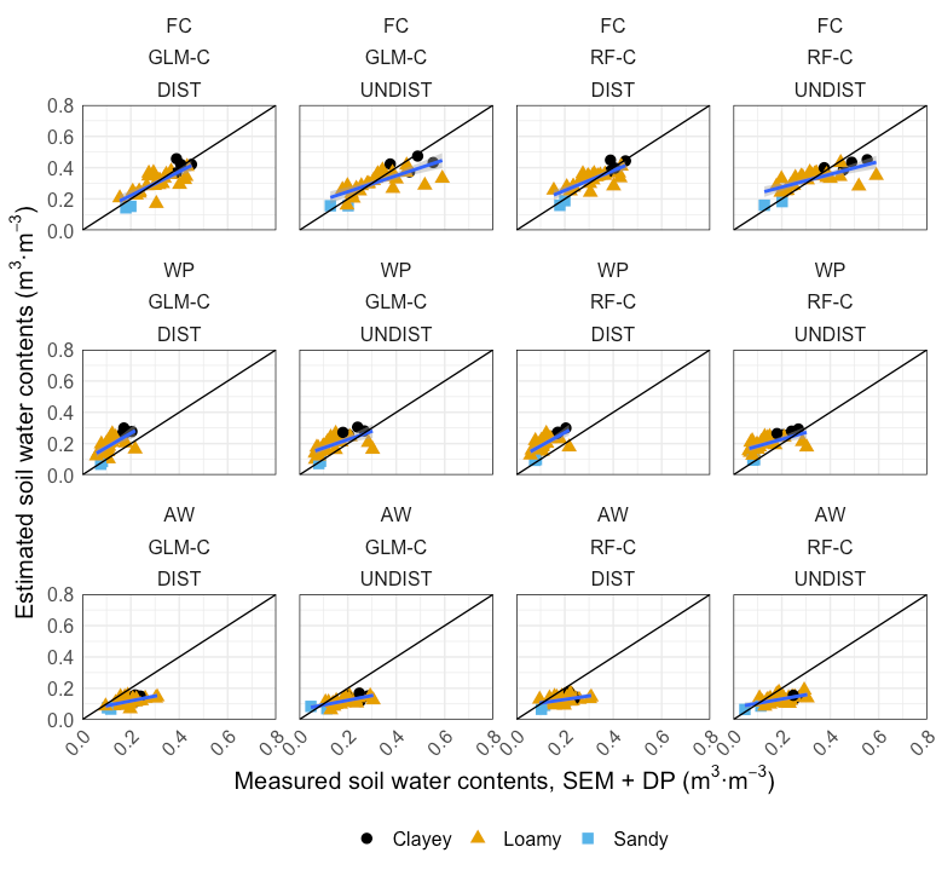

name: about-me
class: about-me-slide, inverse, middle, center

# About me


*Sara Acevedo*

*Dr. (c) Ciencias de la Ingeniería, PUC*
*Msc. Soil and Biogeochemistry, UCDavis*

.fade[Pontificia Universidad Católica de Chile<br>Santiago, Chile]

[`r icons::fontawesome("link")` saryace.github.io](https://saryace.github.io)
[`r icons::fontawesome("twitter")` @saryace](https://twitter.com/saryace)
[`r icons::icon_style(icons::fontawesome("github"), scale = 1)` @Saryace](https://github.com/Saryace)
---
name: about-me
class: about-me-slide, inverse, middle, center

# About Soil Biophysics Lab


*Laboratorio de Biofísica de Suelos*

*PI: Dr. Carlos Bonilla*

.fade[Pontificia Universidad Católica de Chile<br>Santiago, Chile]

[`r icons::fontawesome("link")` biofisica.ing.puc.cl](https://biofisica.ing.puc.cl)
[`r icons::fontawesome("twitter")` @soilbiophysics1](https://twitter.com/soilbiophysics1)
[`r icons::icon_style(icons::fontawesome("instagram"), scale = 1)` @soilbiophysicslab](https://www.instagram.com/soilbiophysicslab)
---

class: inverse

## Soil Biophysics Laboratory

```{r,out.width='100%', fig.height=5,echo=FALSE,warning=FALSE,message=FALSE}
library(leaflet)
library(dplyr)
leaflet() %>%
  addTiles() %>%
  addPopups(lng = -70.6149164,
             lat =  -33.4995699,
             popup = "Soil Biophysics Lab",
             options = popupOptions(closeButton = FALSE)) %>% 
  setView(lng = -70.6149164,
          lat =  -33.4995699,
          zoom = 17)
```
---

background-image: url('img/program3.png')
background-size: cover
class: middle, center, inverse

# **Introduction**

---

class: middle

## Laboratory-scale data management
###from spreadsheets to large datafiles

.footnote[Source: [Nowogrodzki 2020](https://www.nature.com/articles/d41586-020-00062-z)]
---

##Rationale

.pull-left[

*  Automated data collection overwhelms the ability of scientists to effectively manage and and analyze data (Michener et al., 1997)

* Soil physics has been no exception, transforming over into a data-intensive field. 

* Datasets are only getting bigger — and more challenging to work with (Nowogrodzki 2020)

]

.pull-right[

]

---

.pull-left[
## Some challenges of generating soil datasets

* Human error
* Data unshareable or cryptic
* Inconsistencies in data analysis 
]

.pull-right[
<br>
<br>
<br>
 **Typing files names be like:**
.typed[]
]

---
.pull-left[
## Proper laboratory-scale data management can: 

* Decrease human source of errors
* Increase accessibility of data through time 
* Make research reproducible and collaborative
]

.pull-right[
]

---

#This presentation will cover:

##Good practices for laboratory-derived soil datasets
##A demo example of how these practices improve reproducibility 

---

background-image: url('img/lab1.jpeg')
background-size: cover
class: inverse, middle, center

# **Material and methods**

---
class: center

## Example 1: soil water retention curves

```{r,echo=FALSE,warning=FALSE,message=FALSE,fig.retina=5}

```
---

class: center

## Example 2: soil particle size distribution

```{r,echo=FALSE,warning=FALSE,message=FALSE,fig.retina=5}

```
---
```{r}


```

---

class: center

## *agua disponible para las plantas*

```{r,echo=FALSE,warning=FALSE,message=FALSE,fig.retina=5}
library(tidyverse)
water_content <- tribble(
  ~id, ~drainable, ~plant_aw,  ~unavailable,~solid_fraction,
  "SueloA", 0.20, 0.13, 0.14, 0.53,
  "SueloB", 0.15, 0.15, 0.13, 0.57,
  "SueloC", 0.14, 0.17, 0.14, 0.53)
water_long <- water_content %>% pivot_longer(drainable:solid_fraction, names_to = "volumetric_value") %>%
                                mutate(volumetric_value = fct_relevel(volumetric_value, c("drainable",
                                                                                          "plant_aw",
                                                                                          "unavailable",
                                                                                          "solid_fraction")))
ggplot(water_long, aes(fill = volumetric_value,
                        y = as.numeric(value),
                        label = value,
                        x = id)) +
  geom_bar(position="fill", stat="identity", width=0.80, alpha=0.8) +
  coord_flip() +
  scale_fill_manual(labels=c("Porosidad\ndrenable","Agua disponible\npara las plantas","Agua no\ndisponible","Fracción sólida"),
                    values=c("dodgerblue","palegreen3","slategray3","saddlebrown"))+
  geom_label(position = position_fill(vjust = .5), color = "#FFFFFF",show_guide  = F) +
  ggtitle("Contenidos volumétricos de suelo y agua") +
  ylim(x=c(0,1)) +
  labs(x="", y="") +
  theme(axis.line = element_line(size=1, colour = "black"),
        panel.grid.major = element_line(colour = "#d3d3d3"),
        panel.grid.minor = element_blank(),
        panel.border = element_blank(),
        plot.title = element_text(size = 14, family = "Tahoma", face = "bold"),
        text=element_text(family="Tahoma"),
        panel.background = element_blank(),
        legend.position="bottom",
        legend.title = element_blank())+
  theme(plot.margin=unit(c(3,2,3,2),"cm"))
```

---

class: center

## *estructura del suelo* y *tamaño de poros*

```{r,echo=FALSE,results='hide',warning=FALSE,message=FALSE,fig.retina=5}
library(soilphysics)
library(tidyverse)
theme_set(theme_bw())
x <- seq(log10(1),log10(15000),len=100)
h <- 10^x
y1<- psd(thetaS = 0.7, thetaR = 0.005,
        alpha = 0.021,n= 1.5, h = h)
y2<- psd(thetaS = 0.3, thetaR = 0.01,
         alpha = 0.066,n= 6, h = h)
psd <- tibble(x = x, Soil1= y1, Soil2=y2)
psd_plot <- psd %>% pivot_longer(Soil1:Soil2, names_to = "psd")
ggplot(psd_plot,aes(x = x, y = value, pch=psd)) +
  geom_line(aes(linetype=psd), size=2) +
  labs(y=expression(delta*contenido.humedad/delta*succión),
       x= "Radio de poro equivalente"~(mu*m)) +
  annotate("text", x = 2.2, y = 0.0205, label = "Suelo fino (fine)") +
  annotate("segment", x = 1.7, y = 0.0205,
           xend = 1.4, yend = 0.021,
           arrow = arrow(angle = 20, length = unit(2, "mm"), type = "closed")) +
  annotate("text", x = 2.2, y = 0.0055, label = "Suelo grueso (coarsed)") +
  annotate("segment", x = 1.7, y = 0.005,
           xend = 1.6, yend = 0.004,
           arrow = arrow(angle = 20, length = unit(2, "mm"), type = "closed")) +
  ggtitle('Distribución de tamaño\nde poros derivada de curvas de retención de humedad') +
  theme(legend.position = "none")+
  theme(plot.margin=unit(c(3,2,3,2),"cm"))
```
---
.pull-left[
### ¿Qué es lo que queremos?
.x[
* curvas de retención de humedad de alta calidad
* poco tiempo 
* datos confiables
]
]
.pull-right[
### ¿Qué es lo que tenemos?
.checked[
* Tiempo limitado en laboratorio (pandemia)
* Terrenos agotadores
* Incertidumbre en los datos
]
]

---

## ¿Es posible estimar<br>estas curvas de retención de humedad?

---

## ¿Es posible estimar<br>estas curvas de retención de humedad?

----

.left-col[.center[
`r icons::icon_style(icons::fontawesome("car-side"), scale = 1.5)`
### con levantamiento de datos en terreno
]]

--

.center-col[
.center[
`r icons::icon_style(icons::fontawesome("chart-bar"), scale = 1.5)`
### con análisis de laboratorio 
]]

--

.right-col[.center[
`r icons::icon_style(icons::fontawesome("r-project"), scale = 1.5)`
### con desarrollo de modelos predictivos
]]

---

background-image: url('img/img.jpeg')
background-size: cover
class: inverse, middle, center

# **Terreno**

---
class: inverse

## Diversidad de suelos en un largo país
```{r,out.width='100%', fig.height=5,echo=FALSE,warning=FALSE,message=FALSE}
library(leaflet)
library(tidyverse)
data_sitios <- tribble(~lat,~lng,
                         -33.56772,-71.15036,
                         -34.61548,-71.04289,
                         -36.08086,-71.66079,
                         -33.43766,-70.81793,
                         -34.83210,-70.97333,
                         -50.96419,-72.86686,
                         -34.54030,-70.97252,
                         -35.51910,-72.26669,
                         -36.99625,-73.13973,
                         -51.02275,-72.98324,
                         -33.64193,-70.77460,
                         -51.02813,-73.02543,
                         -50.97429	,-72.87528,
                         -32.468018,-71.24934,
                         -34.96855,-71.16662,
                         -35.45329,-72.09532,
                         -33.96341,-71.51518,
                         -33.48246,-71.28006,
                         -18.48412,-70.321991,
                         -41.31810,-72.99322,
                         -34.58270,-71.80640,
                         -51.07182,-73.09376,
                         -34.39007,-71.98833,
                         -41.31784,-72.99256,
                         -34.83043,-71.12582,
                         -33.25507,-71.43482,
                         -33.42350,-70.63670,
                         -33.52797,-70.75530,
                         -33.98423,-71.39783,
                         -33.46370,-70.83870,
                         -33.023636,-71.503319,
                         -34.47399,-70.98392,
                         -38.65667,-72.63450)
  
  data_sitios %>% 
    leaflet() %>%   
    addTiles() %>%
    addCircles(lng = ~ lng, lat = ~ lat,
               color = "darkgreen") 
```
---
class: inverse

## Diversidad de suelos en un largo país

```{r echo = FALSE}

```
---
class: inverse

## Diversidad de suelos en un largo país

```{r echo = FALSE}

```
---

#¿Cómo obtenemos una curva?

```{r echo = FALSE}

```

* Nuevas metodologías que permiten curvas de alta resolución
* Metodologías concatenadas (análisis en tandem)

---
class: center

```{r,echo=FALSE,warning=FALSE,message=FALSE,fig.retina=5}
library(SoilHyP)
library(ggplot2)
library(scales)
library(hrbrthemes)
data(dataSHP)
  dataSHP %>%
    filter(suc < 0) %>% 
    mutate(suc = -10*suc) %>% 
    mutate(Equipo = "Evaporación") %>% 
    add_row(th = c(0.15,0.11,0.07,0.055),
            suc = c(8000,9000,12000,14000),
            Equipo = rep("Punto de Rocío")) %>%
    ggplot(aes(x=suc, y=th, color = Equipo)) +
    geom_point(aes(group = seq_along(Equipo)))+
    scale_x_log10(
      breaks = trans_breaks("log10", function(x)
        10 ^ x),
      labels = trans_format("log10", math_format(10 ^ .x))
    ) +
    scale_y_continuous(breaks = seq(from = 0.05, to = 0.9, by = 0.1)) +
    labs(title="Curva de retención de humedad",
         subtitle="Datos del paquete {SoilHyP} + datos como ejemplo",
         caption="elaboración propia") + 
    theme_ipsum() +    
    ylab("contenido volumétrico de humedad") +
    xlab("succión (hPa)") 
```
---

background-image: url('img/program3.png')
background-size: cover
class: middle, center, inverse

# **Programación**

---

#Generando modelos predictivos

```{r echo = FALSE}
knitr::include_graphics("img/program2.jpeg")
```

* Lenguaje utilizado: R
* Investigación basada en datos colaborativa

---

#Generando modelos predictivos

```{r echo = FALSE}
knitr::include_graphics("img/program.png")
```

* Análisis estadístico
* Modelos predictivos: función de pedotransferencia (PTF)
* Visualización de datos

---

#ejemplo función de pedotransferencia (PTF)

```{r echo = FALSE}
knitr::include_url("https://biofisica.shinyapps.io/Borrador/",
                   height = "350px")
```

---

#  Investigación reproducible

* Sintáxis y manejo de datos tidy
* Reproducibilidad de datos
* Developer Max Kuhn {library(caret)} {library(tidymodels)}

 

.footnote[Figura: [RStudio](https://rviews.rstudio.com/2019/06/19/a-gentle-intro-to-tidymodels/)]

---
class: center

## Mi tesis doctoral:

Evaluation of machine learning algorithms for estimating soil water characteristics obtained by basic soil data in Central Chile

```{r echo = FALSE,out.width='50%', fig.height=3}

```

---
class:center

## Resultados generales

```{r echo = FALSE,out.width='50%', fig.height=4}

```
.footnote[Publicación under review]
---
class: goodbye-slide, inverse, middle, right

.pull-right[
# Thanks for watching this presentation!

### Questions? Comments? 

.left[
[saryace.github.io `r icons::fontawesome("link")`](https://saryace.github.io)<br/>
[@saryace `r icons::fontawesome("twitter")`](https://twitter.com/saryace)<br/>
[@Saryace `r icons::fontawesome("github")`](https://github.com/Saryace)<br/>
]]
---